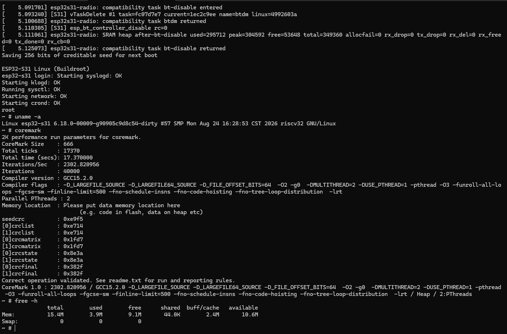

# Linux 6.18 for ESP32-S31
MMU RV32 Linux running natively on an ESP32-S31 microcontroller.

Module tested: ESP32-S31-WROOM-3 E1H16R16V (ESP32-S31 Core Board/Korvo).

<p align="center">
  
</p>

> **WARNING: Experimental**
> Definitely not something you want for production.

## Quick Start

Install `esptool`, Espressif's tool for flashing ESP32s:

```bash
$ pip install esptool
```

Then download the binaries in [Release](https://github.com/GrieferPig/esp32-s31-linux/releases), connect your board through USB-UART, and flash the board per the provided command below (change `/dev/ttyUSB0` to your actual serial device):

```bash
$ esptool -p /dev/ttyUSB0 -b 2000000 erase-flash
$ esptool -p /dev/ttyUSB0 -b 2000000 write-flash \
    --flash-mode dio --flash-freq 80m --flash-size 16MB \
    0x2000 bootloader.bin \
    0x8000 partition-table.bin \
    0x20000 hello_world.bin \
    0x220000 fw_payload.bin \
    0x400000 xipImage \
    0xA00000 rootfs.sqfs
```

## Porting progress

### General

| Feature | Status |
|---|---|
| Buildroot rootfs | 🟢 Stable |
| Reboot | 🟡 Experimental (some boards require an external reset) |
| Poweroff | 🔴 Not Implemented |
| Linux native wireless | 🟡 Experimental |
| - WiFi | 🟡 Experimental |
| - Bluetooth Dual Mode | 🟡 Experimental |
| Dual core SMP | 🟡 Experimental |

### Peripheral Drivers

> Note: There has been a major CLIC driver change since 8/21/26's dual hart SMP commit, these drivers below haven't been tested since then (unless marked otherwise). The statuses below show their state before the CLIC driver change.

| Feature | Status |
|---|---|
| AXI GDMA | 🟡 Experimental |
| AHB GDMA | 🟡 Experimental |
| Cache driver | 🟡 Experimental (Tested since SMP) |
| TRNG | 🟡 Experimental |
| eFuse | 🟡 Experimental |
| Watchdog | 🟡 Experimental |
| PWM, counter, analog peripherals | 🟡 Experimental |
| CLIC/CLINT interrupt driver | 🟡 Experimental (Tested since SMP) |
| Flash MTD driver | 🟡 Experimental (Tested since SMP) |
| Timers | 🟠 WIP |
| Clock tree | 🟠 WIP |
| Security accelerators | 🟠 WIP |
| LP subsystem & IPC | 🔴 Not Implemented |
| PMP/APM | 🔴 Not Implemented (properly) |


### Connectivity Drivers
| Feature | Status |
|---|---|
| UART0 console | 🟢 Stable (Tested since SMP) |
| UART1/2 | 🟡 Experimental |
| GMAC Ethernet | 🟡 Experimental |
| SDMMC | 🟡 Experimental |
| GPIO | 🟡 Experimental (Tested since SMP) |
| pinctrl/GPIO Matrix | 🟡 Experimental |
| USB | 🟠 WIP |
| I2C | 🔴 Not Implemented |
| I2S | 🔴 Not Implemented |
| SPI | 🔴 Not Implemented |
| RMT | 🔴 Not Implemented |
| USB Serial/JTAG | 🔴 Not Implemented |


> 🟢 **Stable** — Fully tested and working | 🟡 **Experimental** — Seems working; not thoroughly tested | 🟠 **WIP** - Functions not fully implemented

## Build Instructions

Refer to the [Build Instructions](docs/build.md).

### Function-CoreBoard native radio candidate

The `feature/function-coreboard-native-radio` profile adds a persistent
SquashFS/JFFS2 overlay, DHCP Ethernet, Dropbear SSH with persistent host keys,
NTP, native `wlan0`, native `hci0`, and compact management commands:

```sh
s31-wifi scan
s31-wifi connect "SSID" "passphrase" --save
s31-wifi status
s31-ble up
s31-ble scan 15
s31-ble down
s31-usb-storage status
```

The 4 MiB rootfs also includes `ip`, `ethtool`, CA-verified HTTP/HTTPS
`curl`, `nc`, `tracepath`, and the tiny `nano` editor with a `pico` alias.
The curl build is intentionally limited to HTTP and HTTPS so that the gateway
tools and the complete CA bundle fit in the fixed rootfs slot.

For first boot, Wi-Fi, Ethernet, SSH, HTTPS, editor, persistence, BLE, and USB
storage checks, follow the
[Function-CoreBoard test guide](docs/function-coreboard-test.md).

For rebuilding on another Mac or Linux host and maintaining each subsystem,
use the [Function-CoreBoard maintainer handbook](docs/maintainer/README.md). It
documents pinned build inputs, the authoritative flash map, persistence,
Ethernet, Wi-Fi, DNS/NTP, SSH host keys, rootfs sizing, BLE, USB, recovery, and
the known-good hardware baseline.

To choose a build without remembering Make variables, run the interactive
feature selector:

```sh
./tools/s31-build
```

It supports Wi-Fi-only, Wi-Fi+BLE gateway, optional USB-storage variants, and
native Linux or reproducible Docker builds. Ethernet LAN remains enabled in
every profile with DHCP by default and persistent static-IP support. See the
[feature selector guide](docs/maintainer/feature-build-selector.md).

The default kernel leaves USB mass storage disabled. Build the separately
testable variant with `S31_USB_STORAGE=1`; do not replace the normal recovery
candidate until the USB host path has passed an on-board boot test.

The raw 16 MiB layout reserves 6 MiB for Linux, 1 MiB for persistent JFFS2,
and 4 MiB for the SquashFS rootfs. `make layout-check` verifies these boundaries
before producing an image. A merged full-flash image resets persistence because
raw `merge-bin` output pads the persistent gap with `0xff`; use the segmented
`flash-all` target for routine updates that preserve user data.

On the currently tested Function-CoreBoard, Linux completes shutdown after
`reboot` but does not assert the final SoC reset. Use the board reset control or
a non-destructive USB-DBG reset to start it again; persisted data survives this
reset.

## S31 Quirks

(For more hardware references, see `docs/` folder)

This port was done before S31 TRM is available, therefore these guessworks were made:

### CLIC v. PLIC v. CLINT

S31 uses CLIC and CLINT similar to P4. Linux expects PLIC. Therefore a custom CLIC driver is needed. I referenced [this CLIC patch](https://github.com/litex-hub/linux-on-litex-vexriscv/pull/438) from [disdi](https://github.com/disdi) to get the CLIC working.

Also, standard RISC-V interrupt CSRs are not usable, presumably because, from P4's TRM, CLINT interrupts are routed to CLIC and `mtvec.MODE` is hardwired to `0x3` (CLIC mode). Patches needed to make OpenSBI interrupts work.

### S mode

S31's supervisor mode is not standard and has absolutely no usage in ESP-IDF so a lot of these CSR uses were mostly guessed from either P4's TRM or CSR probing (see `docs/`). For example, the use of `sclicbase(?)` and the lack of `sie`.

S31 implemented [SCLIC (Supervisor CLIC?)](https://esp32.com/viewtopic.php?t=48188) which is confusing since there is no known standardization; According to all laws of esp-idf, `mcliccfg.NMBITS` is not writable. ***IT IS WRITABLE!*** And setting it to `0b01` enables writes to the `clicintattr[i].MODE` field and thus enabling the use of S-mode interrupts.

### OpenSBI and Linux XIP

To save the *precious* 16MB PSRAM memory, OpenSBI was modified to use XIP in flash and internal SRAM (hence the `3915901 KB` firmware size in OpenSBI banner, since flash and SRAM mappings are not continuous).

In mainline linux, XIP support on RISC-V was removed, so 6.12 was used instead which has proper XIP support. 

## FAQ

### ~Why not SMP?~

Edit: *SMP support is added.* Espressif's radio blobs exposes a set of OSI (OS interfaces). Radio support is accomplished by emulating a compatible OSI using Linux kthreads. 

### Vibe-coded?

I noticed folks on [Hacker News](https://news.ycombinator.com/item?id=49087499) questioning the use of AI-generated code. For transparency:

- Yes, it is heavily agent-assisted. It do work on real S31 dev boards (there's console output above and binary releases to prove that.) I understand the esp32 microcontroller architecture to some extent, but I barely know how to port Linux to other RISC-V platforms; what I did is to tell the agent something like "Go implement an IPC transport that uses a shared SRAM buffer and an IPC interrupt doorbell" or "sdmmc uses designware ip; search esp-idf usage and port the existing Linux driver over." An AI agent on its own would never discover S31's bespoke hardware behavior without my guidance, for example, that the register `mcliccfg` has writable bits, despite esp-idf saying otherwise. However I admit that AI assistance is the direct reason why I am able to progress this fast, and I did learn a lot about kernel development during the process.
